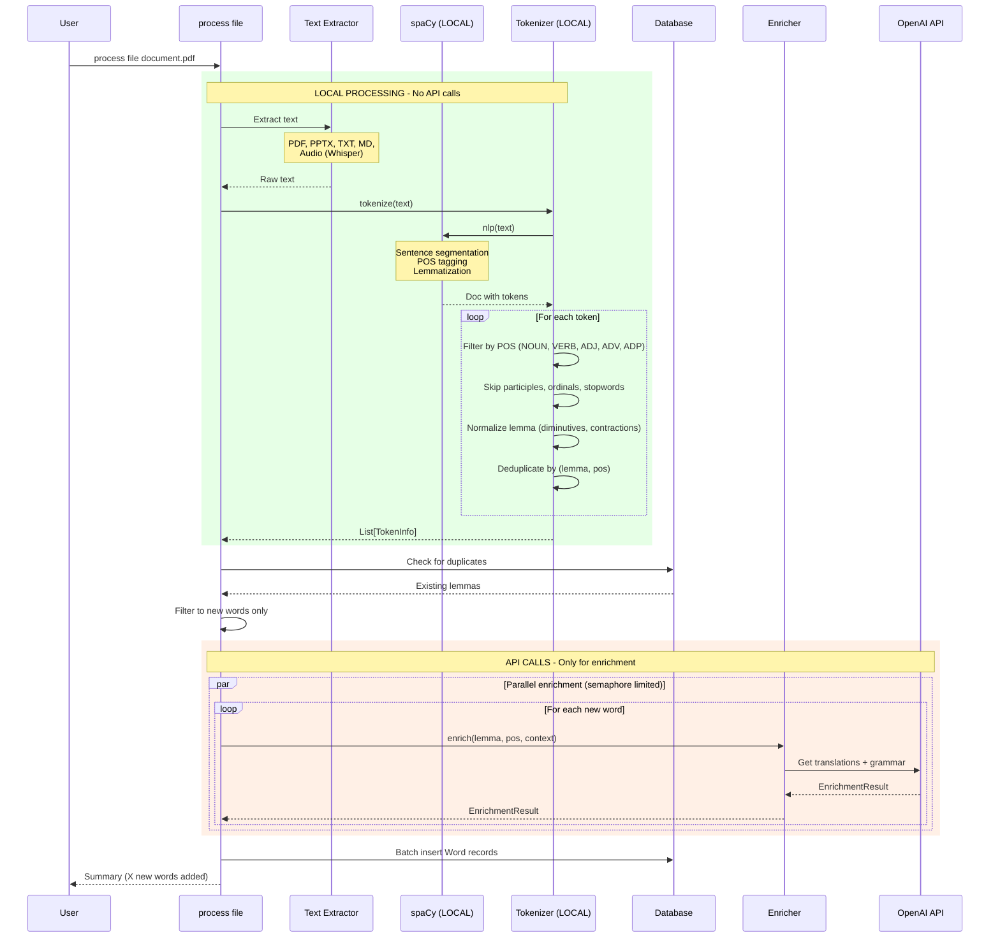
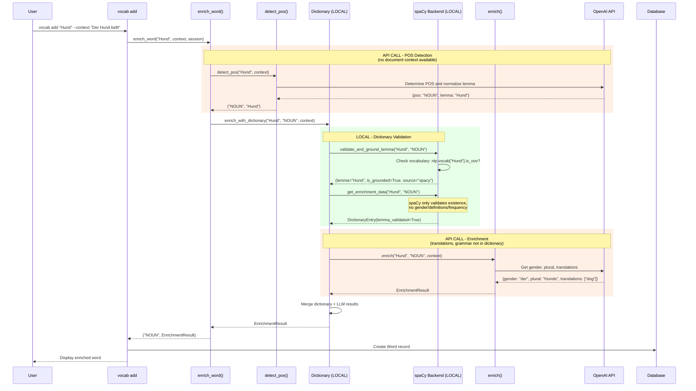
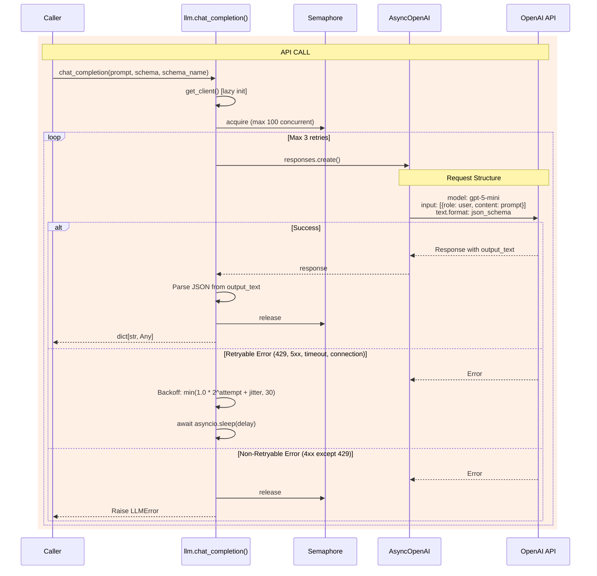
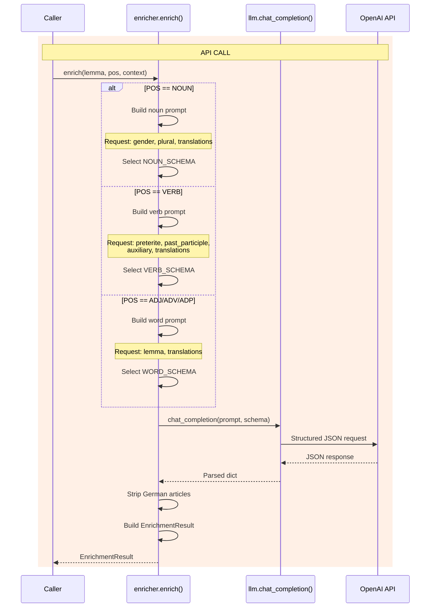
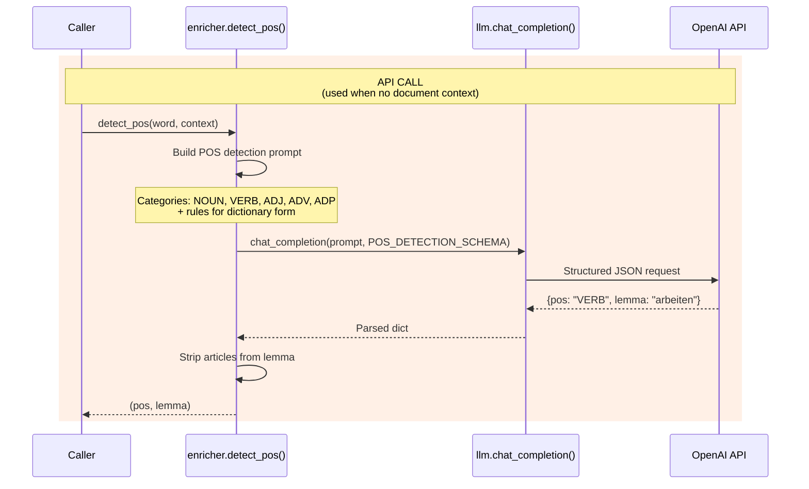
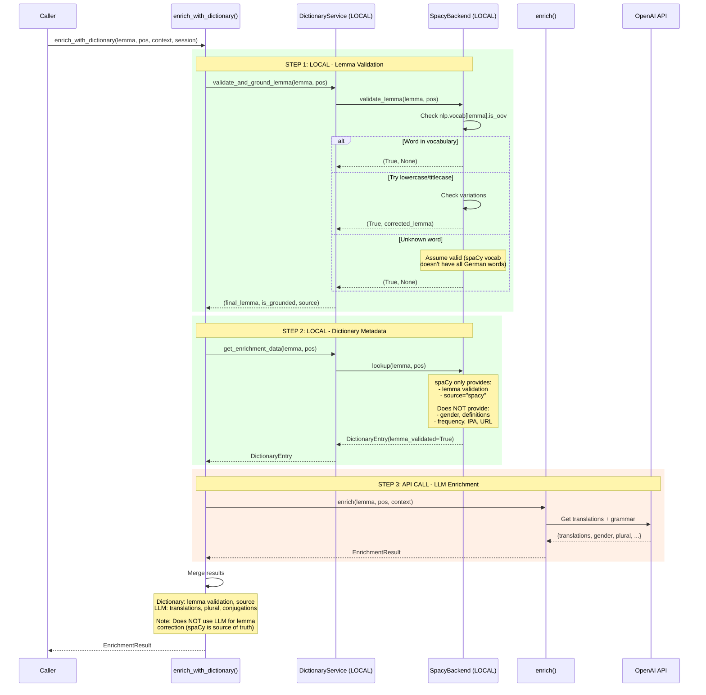
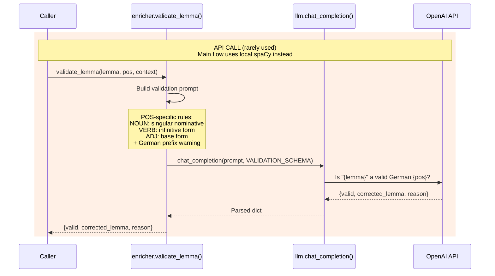
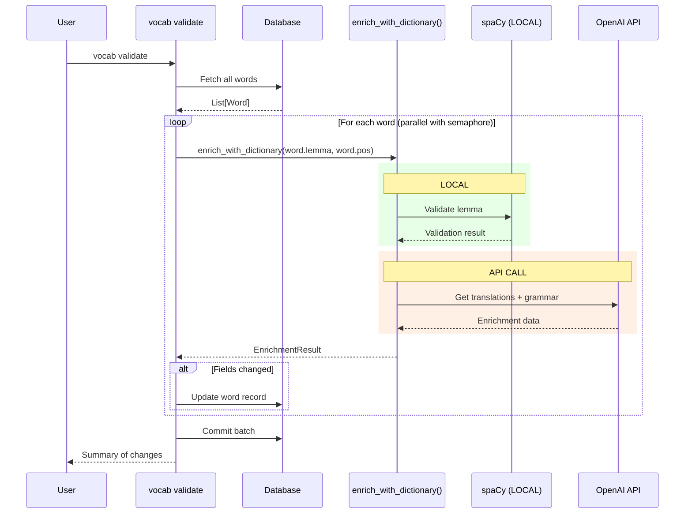
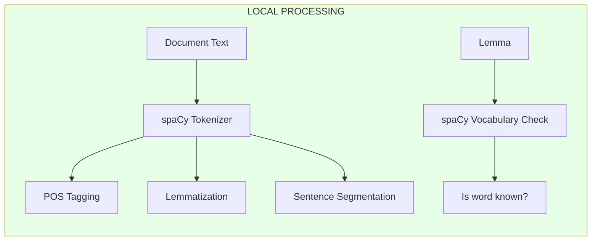
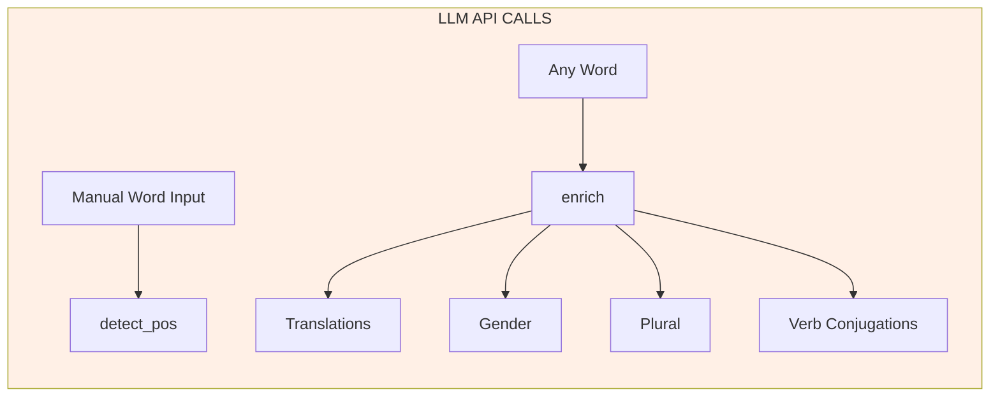

# LLM Pipeline Documentation

This document provides Mermaid sequence diagrams for all processing pipelines in the vocabext application, clearly distinguishing between **local processing** (spaCy, dictionary) and **LLM API calls** (OpenAI).

## Overview

The application uses a hybrid approach:
- **Local processing**: spaCy for tokenization and lemma validation (fast, free, offline)
- **LLM API**: OpenAI for translations, grammar details, and POS detection when context is unavailable

### When Each Is Used

| Operation | Local (spaCy) | LLM (OpenAI) |
|-----------|---------------|--------------|
| Tokenize document text | Yes | No |
| Extract POS from document | Yes | No |
| Extract lemma from document | Yes | No |
| Detect POS (manual input) | No | Yes |
| Validate lemma exists | Yes | No |
| Get translations | No | Yes |
| Get noun gender | Partial | Fallback |
| Get noun plural | No | Yes |
| Get verb conjugations | No | Yes |

---

## Pipeline 1: Document Processing (Mostly Local)

When processing files, most work is done locally by spaCy. OpenAI is only called for enrichment.

Located in `app/services/tokenizer.py` and `app/cli/commands/process.py`.



---

## Pipeline 2: Manual Word Add (Mixed Local + LLM)

When adding a word manually via `vocab add`, we need LLM for POS detection (no document context), but use local dictionary for validation.

Located in `app/cli/commands/vocabulary.py` and `app/services/enricher.py`.



---

## Pipeline 3: Core Chat Completion (LLM Wrapper)

The foundational LLM service with retry logic and concurrency control. Located in `app/services/llm.py`.



---

## Pipeline 4: Word Enrichment (LLM Only)

Enriches German words with grammatical information based on part of speech. Located in `app/services/enricher.py`.



---

## Pipeline 5: POS Detection (LLM Only)

Determines part of speech for words without document context. Located in `app/services/enricher.py`.



---

## Pipeline 6: Dictionary-Grounded Enrichment (Hybrid)

The main enrichment flow that combines local dictionary with LLM. Located in `app/services/enricher.py`.



---

## Pipeline 7: Lemma Validation (LLM - Rarely Used)

This LLM-based validation exists but is NOT used in the main flow. The `enrich_with_dictionary` intentionally uses local spaCy instead.

Located in `app/services/enricher.py`.



---

## Vocab Validate Command

Re-enriches existing words using the hybrid local+LLM flow.



---

## Summary: What Goes Where

### Local Processing (spaCy) - FREE, FAST, OFFLINE



### LLM Processing (OpenAI) - COSTS MONEY, REQUIRES NETWORK



---

## Configuration

| Setting | Default | Description |
|---------|---------|-------------|
| `openai_api_key` | (required) | OpenAI API key from environment |
| `openai_model` | `gpt-5-mini` | Model to use for all LLM calls |
| `dictionary_enabled` | `True` | Enable local dictionary lookup |

---

## JSON Schemas (Used by LLM)

### NOUN_SCHEMA
```json
{
  "properties": {
    "lemma": {"type": "string"},
    "gender": {"type": "string", "enum": ["der", "die", "das"]},
    "plural": {"type": "string"},
    "translations": {"type": "array", "items": {"type": "string"}}
  },
  "required": ["lemma", "gender", "plural", "translations"]
}
```

### VERB_SCHEMA
```json
{
  "properties": {
    "lemma": {"type": "string"},
    "preterite": {"type": "string"},
    "past_participle": {"type": "string"},
    "auxiliary": {"type": "string", "enum": ["haben", "sein"]},
    "translations": {"type": "array", "items": {"type": "string"}}
  },
  "required": ["lemma", "preterite", "past_participle", "auxiliary", "translations"]
}
```

### WORD_SCHEMA
```json
{
  "properties": {
    "lemma": {"type": "string"},
    "translations": {"type": "array", "items": {"type": "string"}}
  },
  "required": ["lemma", "translations"]
}
```

### POS_DETECTION_SCHEMA
```json
{
  "properties": {
    "pos": {"type": "string", "enum": ["NOUN", "VERB", "ADJ", "ADV", "ADP"]},
    "lemma": {"type": "string"}
  },
  "required": ["pos", "lemma"]
}
```
