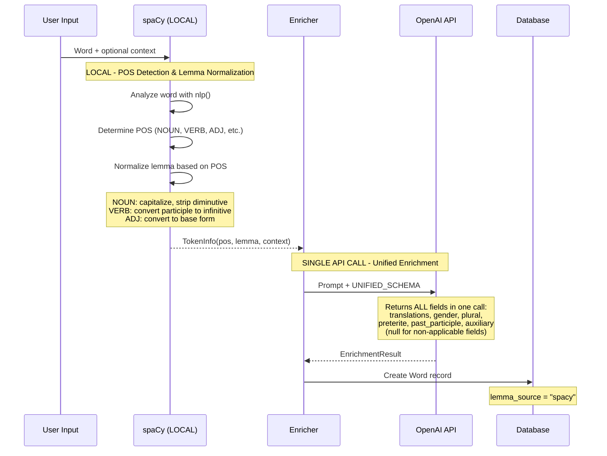
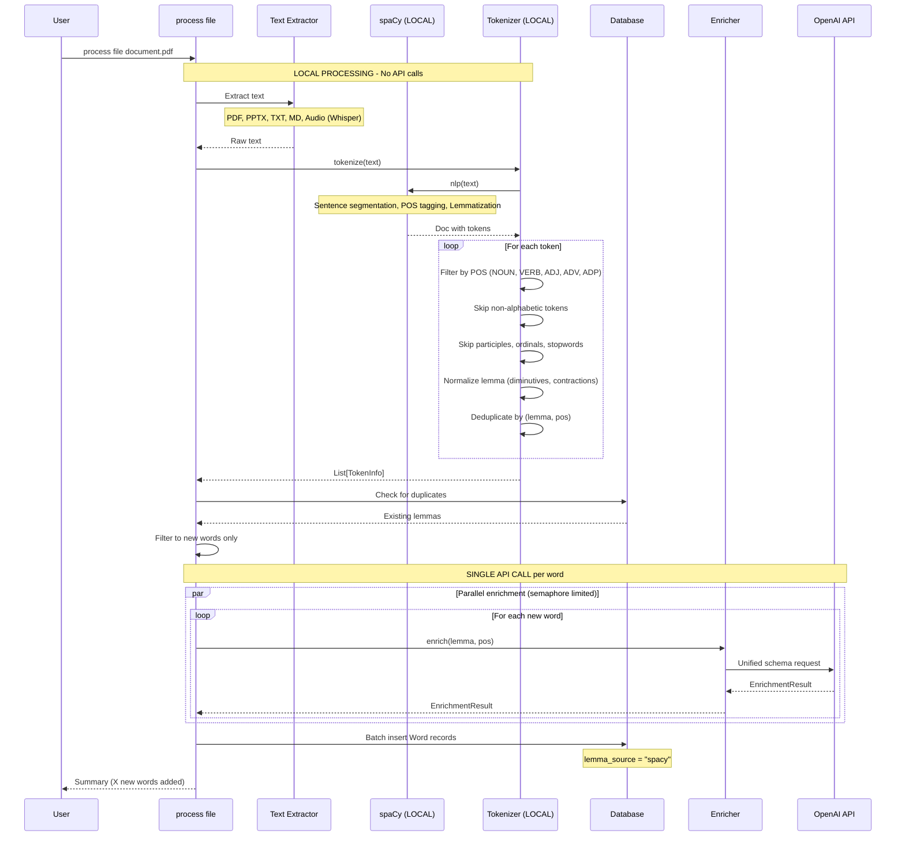
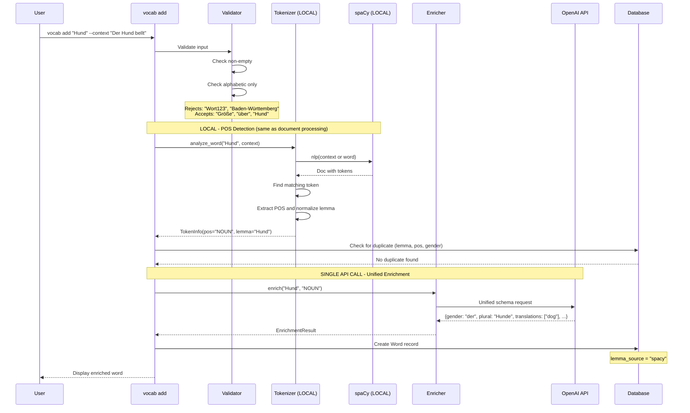
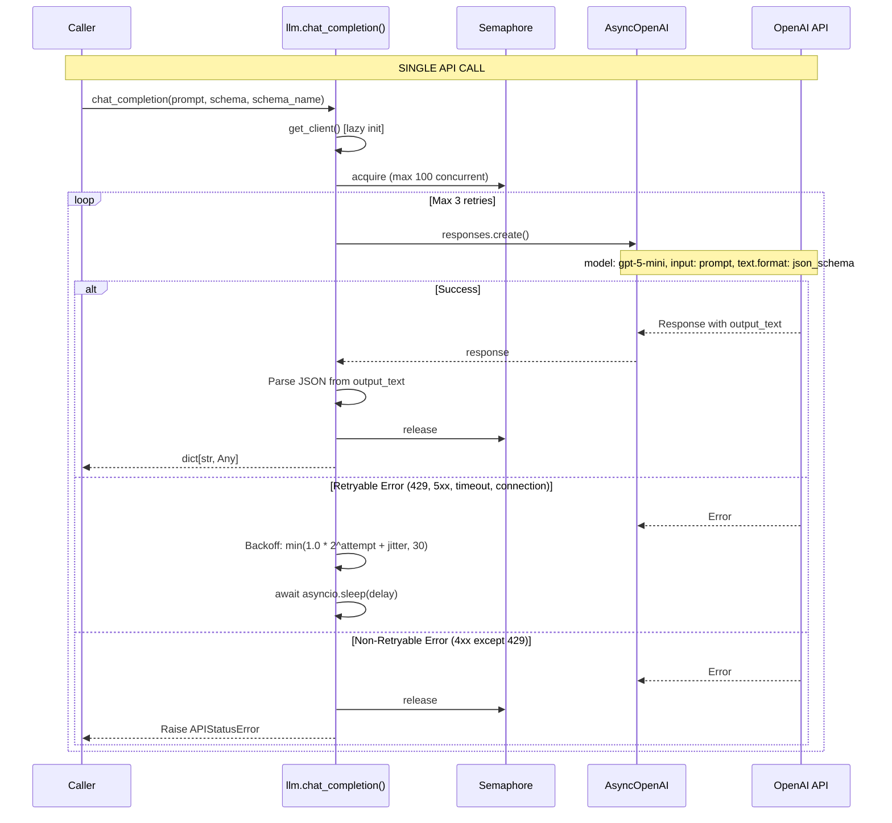
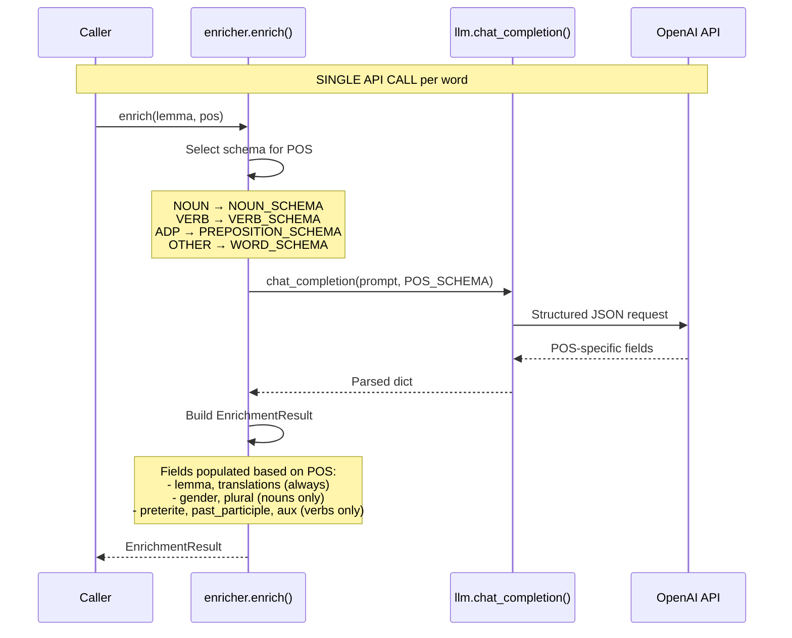
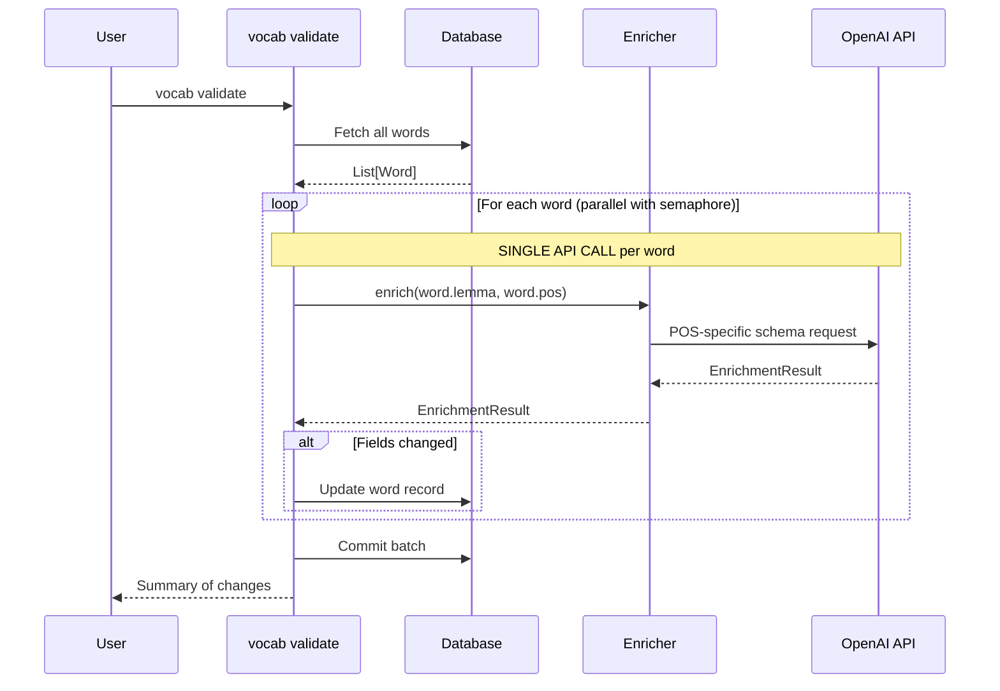
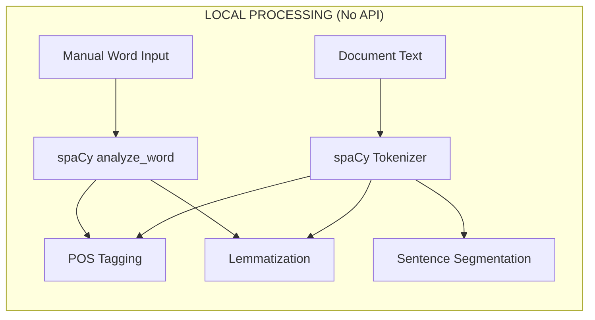
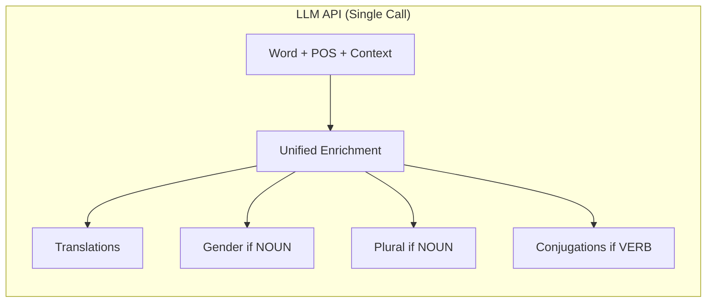
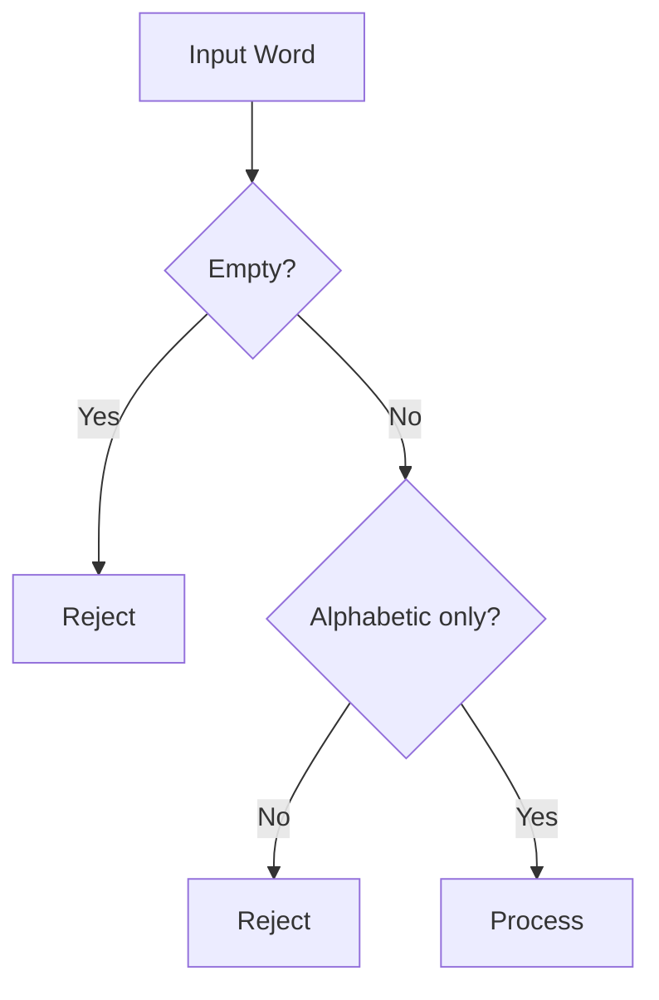

# LLM Pipeline Documentation

This document provides Mermaid sequence diagrams for all processing pipelines in the vocabext application, distinguishing between **local processing** (spaCy) and **LLM API calls** (OpenAI).

## Overview

The application uses a hybrid approach with a **unified pipeline** for all word processing:
- **Local processing**: spaCy for tokenization, POS detection, and lemma normalization (fast, free, offline)
- **LLM API**: OpenAI for translations and grammar details only (single call per word)

### Key Design Principles

1. **Single LLM call per word** - All enrichment data is fetched in one API call using a unified schema
2. **spaCy for all POS detection** - Both file processing and manual word addition use spaCy
3. **Alphabetic-only words** - Only words containing purely alphabetic characters are processed

### When Each Is Used

| Operation | Local (spaCy) | LLM (OpenAI) |
|-----------|---------------|--------------|
| Tokenize document text | Yes | No |
| Extract POS from document | Yes | No |
| Detect POS (manual word add) | Yes | No |
| Normalize lemma | Yes | No |
| Validate lemma exists | Yes | No |
| Get translations | No | Yes |
| Get noun gender | No | Yes |
| Get noun plural | No | Yes |
| Get verb conjugations | No | Yes |

---

## Unified Processing Pipeline

Both `vocab add` and `process file` commands now use the **same pipeline**:



---

## Pipeline 1: Document Processing

When processing files, spaCy tokenizes the entire document and extracts all relevant words.

Located in `app/services/tokenizer.py` and `app/cli/commands/process.py`.



---

## Pipeline 2: Manual Word Addition

When adding a word via `vocab add`, spaCy's `analyze_word()` method determines POS.

Located in `app/cli/commands/vocabulary.py` and `app/services/tokenizer.py`.



---

## Pipeline 3: Core LLM Service

The foundational LLM service with retry logic and concurrency control.

Located in `app/services/llm.py`.



---

## Pipeline 4: Word Enrichment (POS-Specific Schemas)

Single LLM call per word using POS-specific schemas for tighter validation.

Located in `app/services/enricher.py`.



### POS-Specific Schemas

**NOUN_SCHEMA** - For nouns:
```json
{
  "properties": {
    "lemma": {"type": "string"},
    "gender": {"type": "string", "enum": ["der", "die", "das"]},
    "plural": {"type": "string"},
    "translations": {"type": "array", "items": {"type": "string"}}
  },
  "required": ["lemma", "gender", "plural", "translations"]
}
```

**VERB_SCHEMA** - For verbs:
```json
{
  "properties": {
    "lemma": {"type": "string"},
    "preterite": {"type": "string"},
    "past_participle": {"type": "string"},
    "auxiliary": {"type": "string", "enum": ["haben", "sein"]},
    "translations": {"type": "array", "items": {"type": "string"}}
  },
  "required": ["lemma", "preterite", "past_participle", "auxiliary", "translations"]
}
```

**PREPOSITION_SCHEMA** - For prepositions (ADP):
```json
{
  "properties": {
    "lemma": {"type": "string"},
    "cases": {"type": "array", "items": {"type": "string", "enum": ["akkusativ", "dativ", "genitiv"]}},
    "translations": {"type": "array", "items": {"type": "string"}}
  },
  "required": ["lemma", "cases", "translations"]
}
```

**WORD_SCHEMA** - For adjectives, adverbs:
```json
{
  "properties": {
    "lemma": {"type": "string"},
    "translations": {"type": "array", "items": {"type": "string"}}
  },
  "required": ["lemma", "translations"]
}
```

---

## Vocab Validate Command

Re-enriches existing words using POS-specific schemas.



---

## Summary: What Goes Where

### Local Processing (spaCy)



### LLM Processing (OpenAI)



---

## Input Validation

Words must pass validation before processing:



**Accepted**: `Hund`, `Größe`, `über`, `Straße`
**Rejected**: `Wort123`, `Baden-Württemberg`, `test@email`, `word.`

---

## Configuration

| Setting | Default | Description |
|---------|---------|-------------|
| `openai_api_key` | (required) | OpenAI API key from environment |
| `openai_model` | `gpt-5-mini` | Model to use for all LLM calls |
| `spacy_model` | `de_core_news_lg` | German spaCy model for tokenization |

---

## API Call Comparison

### Before (Multiple Calls)
```
vocab add "Hund":
  1. detect_pos() -> LLM call
  2. validate_lemma() -> LLM call (sometimes)
  3. enrich() -> LLM call
  = 2-3 API calls per word
```

### After (Single Call)
```
vocab add "Hund":
  1. analyze_word() -> spaCy (local)
  2. enrich() -> LLM call
  = 1 API call per word
```

This reduces API costs by 60-70% and improves response time.
