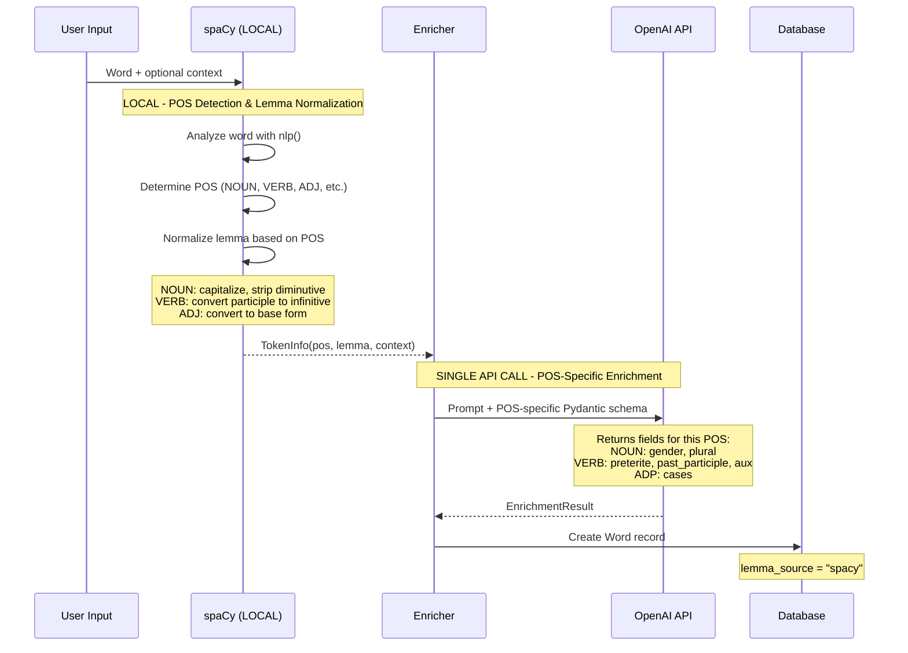
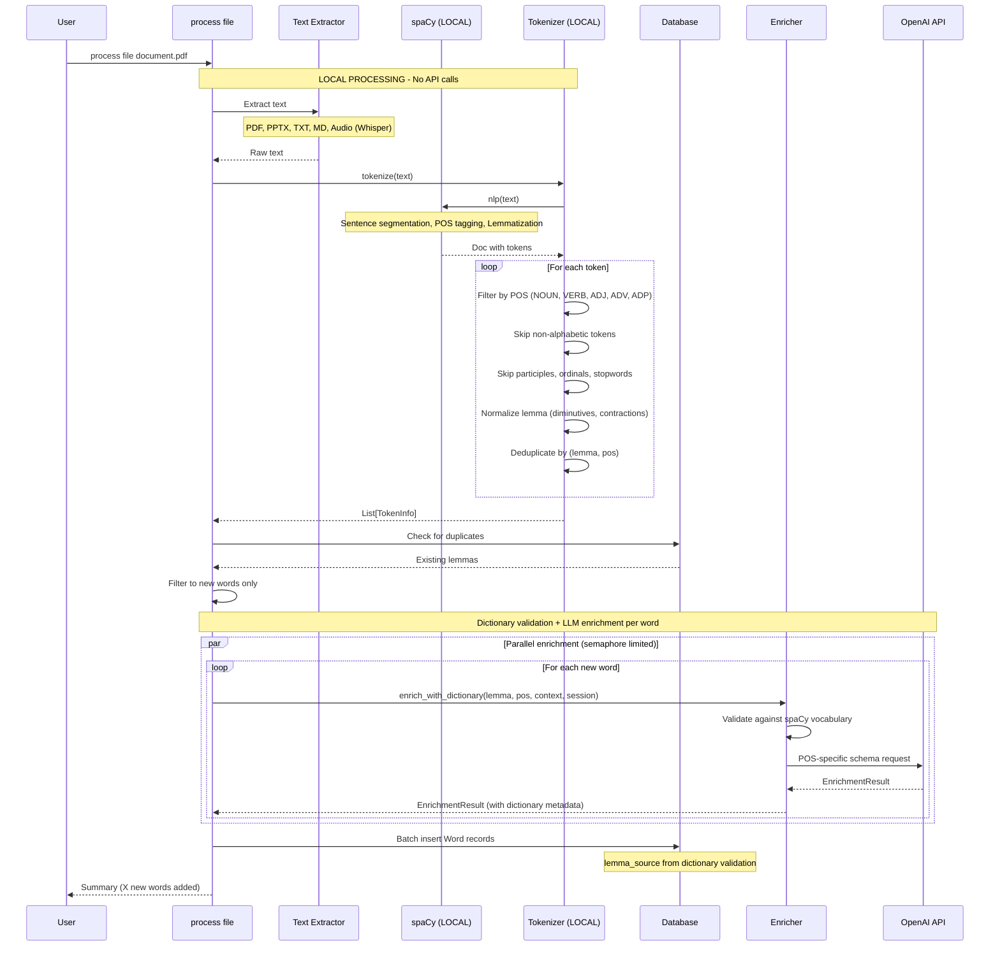
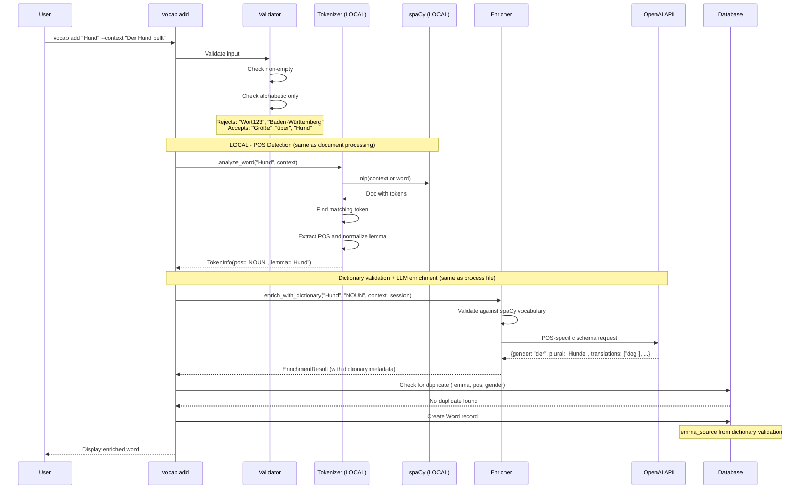
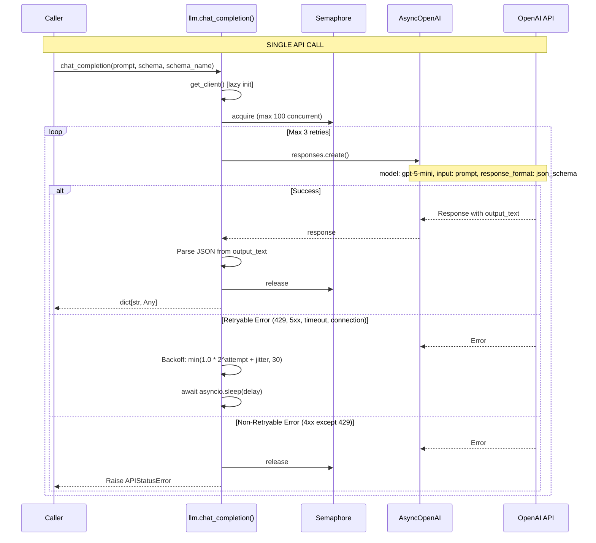
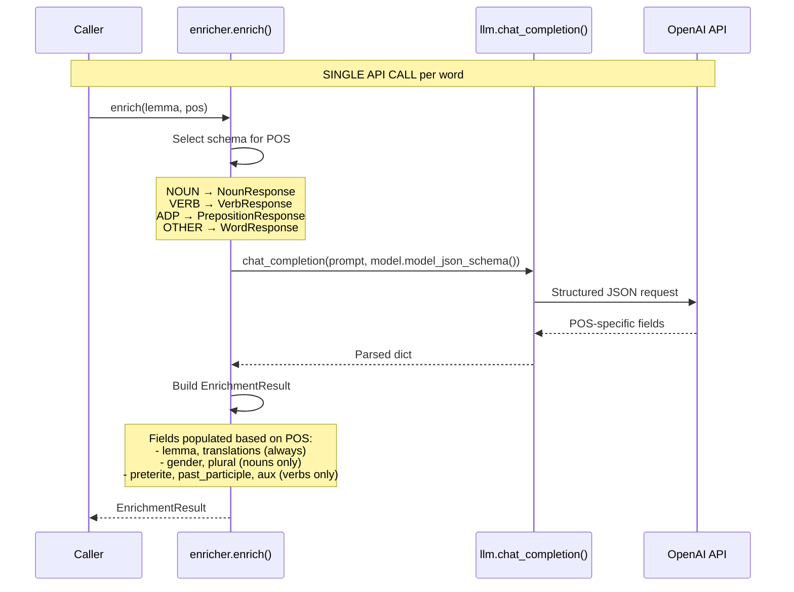
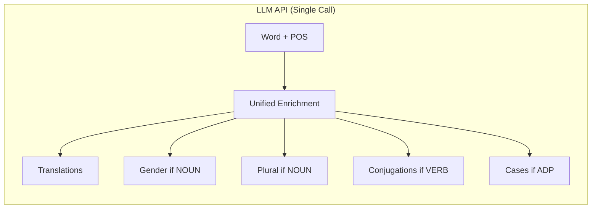

# LLM Pipeline Documentation

This document provides Mermaid sequence diagrams for all processing pipelines in the vocabext application, distinguishing between **local processing** (spaCy) and **LLM API calls** (OpenAI).

## Overview

The application uses a hybrid approach with a **unified pipeline** for all word processing:
- **Local processing**: spaCy for tokenization, POS detection, and lemma normalization (fast, free, offline)
- **LLM API**: OpenAI for translations and grammar details only (single call per word)

### Key Design Principles

1. **Unified pipeline** - Both `vocab add` and `process file` use the same `enrich_with_dictionary()` flow
2. **Dictionary validation first** - Words are validated against spaCy vocabulary before LLM enrichment
3. **Single LLM call per word** - All enrichment data is fetched in one API call using POS-specific Pydantic schemas
4. **spaCy for all POS detection** - Both file processing and manual word addition use spaCy
5. **Alphabetic-only words** - Only words containing purely alphabetic characters are processed

### When Each Is Used

| Operation | Local (spaCy) | LLM (OpenAI) |
|-----------|---------------|--------------|
| Tokenize document text | Yes | No |
| Extract POS from document | Yes | No |
| Detect POS (manual word add) | Yes | No |
| Normalize lemma | Yes | No |
| Validate word exists in dictionary | Yes | No |
| Get translations | No | Yes |
| Get noun gender | No | Yes |
| Get noun plural | No | Yes |
| Get verb conjugations | No | Yes |
| Get preposition cases | No | Yes |

---

## Unified Processing Pipeline

Both `vocab add` and `process file` commands now use the **same pipeline**:



---

## Pipeline 1: Document Processing

When processing files, spaCy tokenizes the entire document and extracts all relevant words.

Located in `app/services/tokenizer.py` and `app/cli/commands/process.py`.



---

## Pipeline 2: Manual Word Addition

When adding a word via `vocab add`, spaCy's `analyze_word()` method determines POS.

Located in `app/cli/commands/vocabulary.py` and `app/services/tokenizer.py`.



---

## Pipeline 3: Core LLM Service

The foundational LLM service with retry logic and concurrency control.

Located in `app/services/llm.py`.



---

## Pipeline 4: Word Enrichment (POS-Specific Schemas)

Single LLM call per word using POS-specific schemas for tighter validation.

Located in `app/services/enricher.py`.



### POS-Specific Pydantic Models

Schemas are defined as Pydantic models with `ConfigDict(extra="forbid")` for strict validation.
JSON schemas are generated using `model.model_json_schema()`.

**NounResponse** - For nouns:
```python
class NounResponse(BaseModel):
    model_config = ConfigDict(extra="forbid")
    lemma: str
    gender: Literal["der", "die", "das"]
    plural: str
    translations: list[str]
```

**VerbResponse** - For verbs:
```python
class VerbResponse(BaseModel):
    model_config = ConfigDict(extra="forbid")
    lemma: str
    preterite: str
    past_participle: str
    auxiliary: Literal["haben", "sein"]
    translations: list[str]
```

**PrepositionResponse** - For prepositions (ADP):
```python
class PrepositionResponse(BaseModel):
    model_config = ConfigDict(extra="forbid")
    lemma: str
    cases: list[Literal["akkusativ", "dativ", "genitiv"]]
    translations: list[str]
```

**WordResponse** - For adjectives, adverbs:
```python
class WordResponse(BaseModel):
    model_config = ConfigDict(extra="forbid")
    lemma: str
    translations: list[str]
```

---

## Vocab Validate Command

Re-enriches existing words using POS-specific schemas.


---

## Summary: What Goes Where

### Local Processing (spaCy)


### LLM Processing (OpenAI)



---

## Input Validation

Words must pass validation before processing:


**Accepted**: `Hund`, `Größe`, `über`, `Straße`
**Rejected**: `Wort123`, `Baden-Württemberg`, `test@email`, `word.`

---

## Configuration

| Setting | Default | Description |
|---------|---------|-------------|
| `openai_api_key` | (required) | OpenAI API key from environment |
| `openai_model` | `gpt-5-mini` | Model to use for all LLM calls |
| `spacy_model` | `de_core_news_lg` | German spaCy model for tokenization |

---

## API Call Comparison

### Before (Multiple Calls)
```
vocab add "Hund":
  1. detect_pos() -> LLM call
  2. validate_lemma() -> LLM call (sometimes)
  3. enrich() -> LLM call
  = 2-3 API calls per word
```

### After (Single Call)
```
vocab add "Hund":
  1. analyze_word() -> spaCy (local)
  2. enrich() -> LLM call
  = 1 API call per word
```

This reduces API costs by 60-70% and improves response time.
